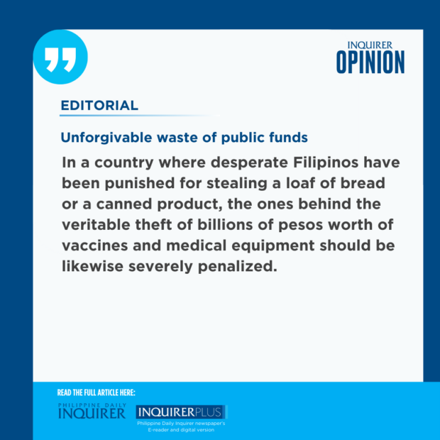

**EDITORIAL**

# Unforgivable waste of public funds

****Philippine Daily Inquirer / 05:00 AM December 11, 2024****

The Department of Health (DOH) has done it again: get flagged by the Commission on Audit (COA), this time for what should amount to criminal negligence that led to the expiration of as much as P11 billion worth of drugs, medicine, and supplies in 2023.

The COA said in its latest audit report on the DOH that as a direct result of “inadequate procurement planning and poor distribution and monitoring systems,” these vital drugs and supplies that included 7.035 million vials of COVID-19 vaccines were unused, wasting precious public money and resources.

For the COVID-19 vaccines, the COA underscored that the wastage was caused by the unwillingness of priority groups, particularly senior citizens, to take succeeding booster shots.

Local government units (LGUs) and health facilities also refused to accept the vaccines because of the lack of cold room storage and doubts over whether they can use the vaccines. Portions of the vaccines were also close to their expiry dates.

As if these were not more than enough, 24,539 bags of donated dialysis solution expired in warehouses and health facilities because these were received about one and a half years before expiry, and the target recipients declined to accept them, also due to lack of storage space, or they believed these can no longer be used.

## Veritable theft

“Inventories nearing expiration or those with less than one-year shelf life amounting to a total of P65,444,524.35 were also found unutilized and undistributed in DOH offices and health facilities as of Dec. 31, 2023,” the COA said.

Given the wastage, Health Secretary Teodoro Herbosa was rightfully called to task, with the COA recommending that the DOH “ensure that proper planning, reasonable allocation, duties, and accountabilities of DOH offices are established for procurement and receipt of vaccines.”

Indeed, wasting even a single peso of public money to the lack of systems and controls that should have been in place from day one in the name of public service should not be accepted.

In a country where desperate Filipinos have been punished for stealing a loaf of bread or a canned product, the ones behind the veritable theft of billions of pesos worth of vaccines and medical equipment should be likewise severely penalized.

The DOH made a feeble attempt to justify the unacceptable lapses, saying that the COVID-19 pandemic was a one-off event, “an emergency, a matter of life and death,” thus the government “decided to procure more COVID-19 vaccines available for all Filipinos at the soonest possible time, than none at all.”

The DOH added that even as the national government said that it would buy vaccines for all Filipinos, the private sector and other LGUs decided to purchase their own, which led to the oversupply and consequent expiration.

## Significant shortcomings

While there is some truth to what the DOH said, it does not erase the fact that there were significant shortcomings in the planning as well as the logistics that led to the unforgivable wastage.

Plus, this was not the first time that the DOH had been called out for a similar egregious offense.

In 2022, the DOH said that it may have lost P22 billion after 44 million COVID-19 vaccines went to waste because of their short shelf life. The majority or as much as 75 percent were bought by the private sector and local governments.

Last year, the COA issued all-too-familiar findings, calling out the DOH in its 2022 annual report for deficient procurement planning, poor distribution and monitoring systems, and other weaknesses in its controls.

This led to P7 billion in drugs, medicine and other items in its inventory being “expired, near expiry, damaged, overstocked, understocked, delayed, or undistributed.”

## Excessive spending

The COA added that the presence of the overstocked as well as slow-moving inventory items “evidenced excessive spending” that could have otherwise gone to other programs as well as supplies and equipment that are badly needed elsewhere in the perpetually cash-strapped public health system.

The weaknesses have been allowed to fester for far too long. Secretary Herbosa should be reminded that under Presidential Decree No. 1445 or the Government Auditing Code of the Philippines, all resources of the government should be managed in accordance with the law to prevent loss or wastage and that adherence to this policy “rests directly with the chief or head of the government agency concerned.”

Only with the firm resolve to correct these lapses can Filipinos renew their faith in the DOH, whose reputation has already been laid low by a series of anomalies, among them the probe into the anomalous COVID-19 related transactions such as the deals between DOH and Pharmally Pharmaceutical Corp. that bagged questionable contracts worth some P11.5 billion.

Indeed, the DOH should cure itself of its ills and regain that strength, vim, and vigor to pursue its mandate and not allow one more centavo to be wasted due to sheer incompetence.