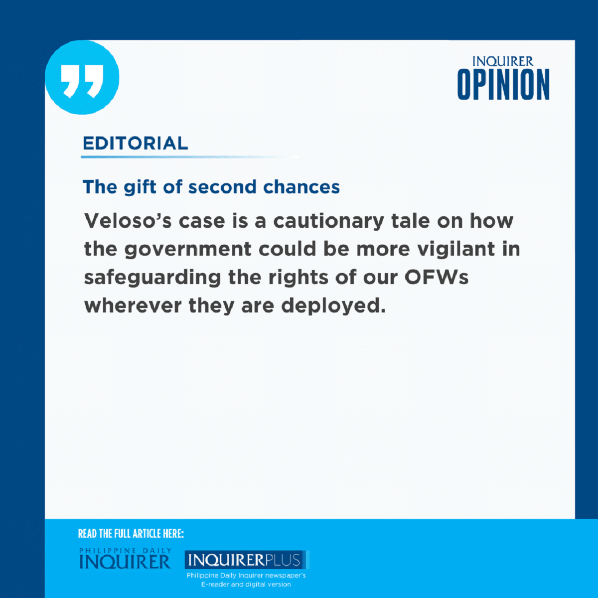

**EDITORIAL**

# The gift of second chances

****Philippine Daily Inquirer / 05:07 AM December 13, 2024****

The impending return from an Indonesian jail of a Filipino migrant worker tricked into being a drug mule is a spot of good news amid the toxic political scuffle of recent weeks.

The Marcos administration announced over the weekend that, following high-level talks and negotiations, Indonesia has agreed to transfer Mary Jane Veloso to Philippine custody after almost 15 years on death row. The mother of two was sentenced to death on drug charges after 2.6 kilograms of heroin was found in her luggage in 2010. She narrowly escaped execution in 2015 after last-minute appeals from the Aquino administration, which had arrested and prosecuted for syndicated estafa two individuals involved in recruiting Veloso and slipping drugs in her suitcase without her knowledge.

In Jakarta, Yusril Ihza Mahendra, Indonesia’s coordinating minister for law, human rights, immigration, and corrections, clarified that Veloso was not being released from her sentence; only that Indonesia had agreed to send her back to the Philippines “as a prisoner.”

## Not an acquittal

“[I]t is not an acquittal, not a pardon,” Yusril said, adding that certain conditions must be met, including recognition of Indonesia’s final court ruling. “Once she returns to her country and continues her sentence there, the responsibility for her rehabilitation shifts to her home country,” he added.

The agreement to repatriate Veloso was “reciprocal,” he said: “If one day Indonesia asks for its citizens jailed in the Philippines to be returned, they must consider it.” A permanent ban on Veloso’s return to Indonesia was also part of the deal.

While no date for Veloso’s return has been set, with Philippine officials saying it might happen before Christmas, the prospect has been widely hailed. President Marcos has expressed “heartfelt gratitude” to Indonesia’s newly elected president Prabowo Subianto for his “goodwill,” while the Commission on Human Rights (CHR) commended the initiative of Philippine authorities “in pursuing justice beyond our own territorial bounds.”

## Victim of circumstances

For sure, as Mr. Marcos said in a statement, Veloso must be held accountable under Indonesian law and the Philippines must respect its legal jurisdiction on her case. But given that Veloso, as the President himself described her, is “a victim of circumstances,” the possibility of clemency is an option that he must seriously consider.

It is a call echoed by the Ecumenical Bishops Forum, a fellowship of Catholic and Protestant bishops, who see Veloso as the “symbol” of overseas Filipino workers (OFWs) and the myriad suffering they endure “at the hands of merciless persons who take [advantage] of their gullibility while seeking overseas employment.”

While Mr. Marcos mulls the grant of clemency that only he can decide on, justice officials have assured Veloso’s family that she would not be detained in the same facilities where her illegal recruiters are currently serving their sentence. The family had earlier expressed fears of retaliation from the syndicate behind her plight amid previous threats to their safety. It is a well-considered move, as this ensures that Veloso can finally testify against these felons for qualified human trafficking in a long overdue court case.

At the same time, as the CHR noted, the government must uphold the Bangkok Rules on the treatment of women prisoners, and “actualize” the efforts needed toward the reformation and possible reintegration of Veloso into mainstream society.

## Cautionary tale

Veloso’s case is a cautionary tale on how the government could be more vigilant in safeguarding the rights of our OFWs wherever they are deployed. As often the case, local authorities only learned of her plight upon her conviction; meanwhile, with the language barrier and ignorance of the laws of her host country, she had unwittingly incriminated herself into a death sentence.

A stronger monitoring mechanism, a hotline, and a legal outreach system should be put in place to help OFWs reach out to Philippine representatives when they get into trouble. To its credit, the former Overseas Workers Welfare Administration had sent an Indonesian legal team, emissaries, and translators posthaste to help extricate Veloso once news of her conviction reached local shores.

But even before they leave, OFWs should be thoroughly warned about possible deception, scams, and red flags they should be wary about from their recruiters, dubious characters who may even be their relatives and neighbors, as in Veloso’s case. A briefing on their host countries’ laws and legal system would be helpful as well, and so would a pamphlet listing the services and assistance they can expect from Philippine representatives in consular offices.

Veloso’s return, possibly before Christmas, is a gift of hope that magnifies the spirit of the season. With clemency on the table, it becomes witness to the grace of second chances for victims of unscrupulous fraudsters.